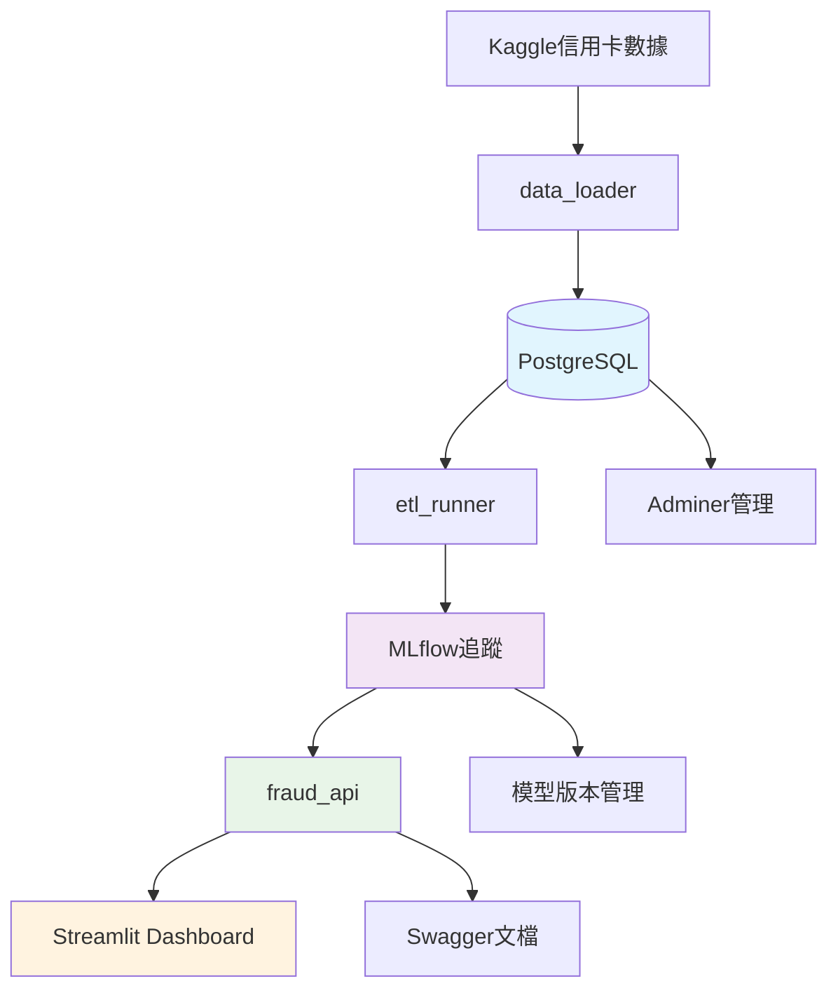

# 💸 端到端詐欺交易偵測系統

## 🔍 專案簡介

完整的**生產級詐欺交易偵測系統**，從資料ETL、模型訓練、實驗追蹤到API部署一應俱全。本專案展示如何將機器學習模型完整產品化，包含完善的監控和可視化界面。

**🎯 核心特色**:
- ✅ **完全Docker化部署** - 一鍵啟動所有服務
- ✅ **MLflow實驗追蹤** - 完整的模型版本管理
- ✅ **高性能XGBoost模型** - F1 Score達0.84
- ✅ **實時預測Dashboard** - 直觀的模型監控界面
- ✅ **生產級架構** - 6個微服務協同運作

## 📂 專案架構

```text
fraud-detection-etl-api/
├── data/                    # Kaggle信用卡詐欺資料集
├── notebooks/               # EDA分析和模型實驗
├── src/
│   ├── etl/                # ETL管道和數據載入
│   │   ├── db_load.py      # 資料庫載入腳本
│   │   └── transform_data.py # 模型訓練和MLflow追蹤
│   ├── api/                # FastAPI預測服務
│   │   ├── main.py         # API主程式
│   │   └── requirements.txt
│   ├── dashboard/          # Streamlit儀表板
│   │   └── app.py          # Dashboard主程式
│   └── models/             # 訓練好的模型資產
├── docker/                 # Docker配置
│   ├── docker-compose.yml  # 服務編排
│   ├── Dockerfile.api      # API容器
│   ├── Dockerfile.dashboard # Dashboard容器
│   └── Dockerfile.mlflow   # MLflow容器
├── SERVICES_GUIDE.md       # 詳細服務指南
└── README.md
```

## 🛠 技術棧

| 領域 | 技術選型 | 說明 |
|------|----------|------|
| **資料庫** | PostgreSQL 16 | 主要數據存儲，支援複雜查詢 |
| **實驗追蹤** | MLflow | 模型版本管理和實驗追蹤 |
| **機器學習** | XGBoost + Scikit-learn | 高性能梯度提升 + 經典ML |
| **API服務** | FastAPI + Uvicorn | 高性能異步API框架 |
| **前端儀表板** | Streamlit | 快速構建ML應用界面 |
| **容器化** | Docker Compose | 完整微服務架構 |
| **資料庫管理** | Adminer | Web端資料庫管理工具 |
| **ETL** | Pandas + SQLAlchemy | 數據處理和ORM |

## 🚀 快速啟動

### 📋 環境需求
- Docker Desktop
- Docker Compose
- 8GB+ RAM（推薦）

### ⚡ 一鍵啟動
```bash
# 1. Clone專案
git clone <your-repo-url>
cd fraud-detection-etl-api

# 2. 啟動基礎服務
cd docker
docker-compose up -d postgres_db mlflow_server

# 3. 載入數據並訓練模型
docker-compose run --rm data_loader
docker-compose run --rm etl_runner

# 4. 啟動應用服務
docker-compose up -d fraud_api fraud_dashboard adminer
```

### 🌐 服務端點

| 服務 | URL | 功能 | 狀態 |
|------|-----|------|------|
| **詐欺預測API** | http://localhost:8000 | RESTful預測服務 | ✅ |
| **Swagger文檔** | http://localhost:8000/docs | API互動文檔 | ✅ |
| **監控Dashboard** | http://localhost:8501 | 模型性能監控 | ✅ |
| **MLflow追蹤** | http://localhost:5000 | 實驗管理 | ✅ |
| **Adminer** | http://localhost:8080 | 資料庫管理 | ✅ |

> 💡 **提示**: 詳細啟動步驟請參考 [SERVICES_GUIDE.md](SERVICES_GUIDE.md)

## 📊 系統架構



### 🔄 數據流程
1. **數據載入**: Kaggle信用卡交易數據 → PostgreSQL
2. **特徵工程**: 創建feature_transactions視圖
3. **模型訓練**: 邏輯迴歸 + XGBoost並行訓練
4. **實驗追蹤**: MLflow記錄所有訓練結果
5. **模型部署**: API自動載入最佳模型
6. **監控展示**: Dashboard顯示性能比較

## 🎯 核心功能

### 📈 模型性能

| 模型類型 | F1 Score | AUC Score | Precision | Recall | 狀態 |
|----------|----------|-----------|-----------|--------|----- |
| **XGBoost** | **0.8394** | **0.9724** | **0.8526** | **0.8265** | ✅ **生產使用** |
| Logistic Regression | 0.1146 | 0.9720 | 0.0611 | 0.9184 | 📊 基準比較 |

### 🔮 預測API

**端點**: `POST /predict`

**請求範例**:
```json
{
  "time": 45000.0,
  "amount": 120.50,
  "v1": -0.96, "v2": 1.24, "v3": -1.0,
  "v4": 0.0, "v5": -0.1, "v6": 0.0,
  "v7": 0.0, "v8": 0.0, "v9": 0.5,
  "v10": 0.0, "v11": 0.0, "v12": 0.0,
  "v13": 0.0, "v14": 0.0, "v15": 0.0,
  "v16": 0.0, "v17": 0.0, "v18": 0.0,
  "v19": 0.0, "v20": 0.0, "v21": 0.0,
  "v22": 0.0, "v23": 0.0, "v24": 0.0,
  "v25": 0.0, "v26": 0.0, "v27": 0.0, "v28": 0.0
}
```

**回應範例**:
```json
{
  "is_fraud": 0,
  "fraud_probability": 0.0234,
  "message": "Transaction analyzed successfully."
}
```

### 📊 智能儀表板
- 🏆 **模型比較**: 即時查看兩個模型的性能指標
- 🔍 **即時預測**: 輸入交易參數，立即獲得詐欺風險評估
- 📈 **實驗追蹤**: MLflow整合，完整的訓練歷史
- 🎛️ **互動介面**: 友善的Streamlit界面

## 💼 商業價值

### 📊 風險控制效益
| 指標改進 | 商業影響 | 預估效益 |
|----------|----------|----------|
| **假陽性降低1%** | 減少誤攔正常交易 | 提升客戶滿意度 |
| **假陰性降低1%** | 減少詐欺損失 | 直接降低財務風險 |
| **F1提升至0.84** | 平衡精確度與召回率 | 最佳化總體績效 |

### 🎯 技術亮點
- ✅ **完整MLOps流程**: 從數據到部署的端到端自動化
- ✅ **微服務架構**: 高可用性和可擴展性
- ✅ **實驗追蹤**: MLflow確保模型可重現性
- ✅ **即時監控**: Dashboard提供實時系統狀態
- ✅ **容器化部署**: Docker確保環境一致性

## 🔮 擴展規劃

### 🚀 近期優化
- [ ] 添加模型A/B測試功能
- [ ] 實現自動模型重訓練
- [ ] 增加更多特徵工程
- [ ] 優化API響應時間

### 🌟 長期願景
- [ ] Kubernetes部署支援
- [ ] 實時流式處理（Apache Kafka）
- [ ] JWT認證和權限管理
- [ ] 雲端部署（AWS/GCP/Azure）
- [ ] Apache Airflow調度

## 📚 學習資源

- 📖 [詳細服務指南](SERVICES_GUIDE.md)
- 🔧 [疑難排解指南](SERVICES_GUIDE.md#疑難排解)
- 📊 [模型性能分析](notebooks/eda_and_baseline.ipynb)
- 🚀 [API使用範例](http://localhost:8000/docs)

---

**🎉 這是一個完整的生產級機器學習系統，展示了從數據科學到軟體工程的最佳實踐！**